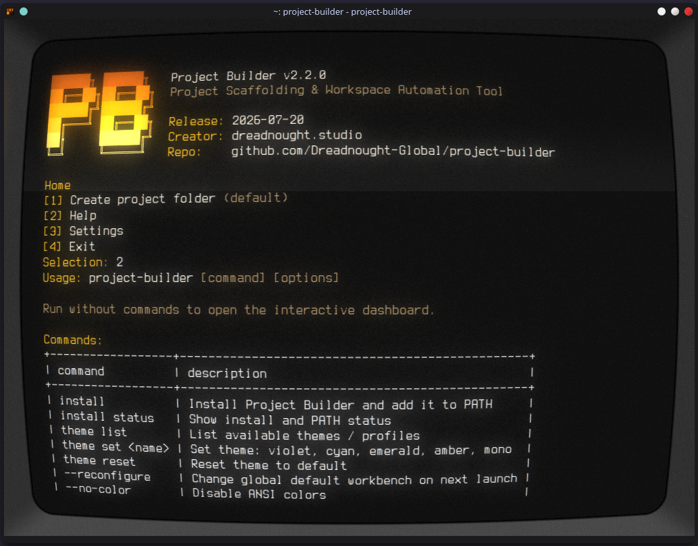

# Project Builder

Project Builder is a cross-platform command line utility written in Go that scaffolds standardized project directory structures for creative disciplines.


## Overview

The tool automates the creation of directory trees for four creative disciplines:
- Design
- Video & Motion
- Audio
- 3D & Animation

It provides a conditional client project overlay (`00_Client_Docs` at the root and `Client_Handoff` within the discipline's final export folders). Client projects are nested under a `00_Client_Projects` directory, while non-client projects are placed under `01_Passion_Projects`.

Upon first project creation, the tool launches an interactive, terminal-based folder browser to select a Global Default Workbench directory. During project creation, users can choose to save different default destinations on a per-discipline basis using an OS-native folder picker dialog or terminal browser. After selection, the chosen folder is shown before the next question. These paths are stored in `config.yaml` and used for subsequent project initializations.

## Installation

Pre-built binaries for Windows, macOS, and Linux are available on the GitHub Releases page.

1. Download the executable appropriate for your operating system.
2. Run the self-install command from the download location:

```bash
./project-builder install
```

On Windows, run:

```powershell
.\project-builder.exe install
```

The installer copies Project Builder into a per-user bin directory and adds that directory to PATH. On first successful install, it displays folder-browser controls and requires `y` acknowledgement once. If the per-user PATH update is blocked by permissions, it asks before requesting administrator access. Open a new terminal after install, then run:

```bash
project-builder
```

Update an existing global installation with:

```bash
./project-builder install --force
```

Check installed release:

```bash
project-builder --version
```

Useful installer checks:

```bash
./project-builder install --dry-run
./project-builder install status
```

Running the binary directly from a terminal (`./project-builder`) is still supported on Linux.

For double-click launching via a file manager, a `project-builder.desktop` file is provided in the release. To install:
1. Copy `project-builder.desktop` to `~/.local/share/applications/`.
2. Edit the `Exec` line in the copied file to point to the absolute path of your compiled binary (e.g. `Exec=/home/user/bin/project-builder`).
3. Make the `.desktop` file executable:
   ```bash
   chmod +x ~/.local/share/applications/project-builder.desktop
   ```

### Configuration Path

The tool stores its configuration file at the following locations:
- **Linux/macOS**: `$XDG_CONFIG_HOME/project-builder/config.yaml` when `XDG_CONFIG_HOME` is set; otherwise `~/.config/project-builder/config.yaml`
- **Windows**: `%APPDATA%\\project-builder\\config.yaml`

## Usage

Run the compiled executable to start the interactive initialization flow:

```bash
./project-builder
```

### Startup Interface

Project Builder clears the terminal on launch and before major steps, then renders the compact gradient `PB` banner, release metadata from `CHANGELOG.md`, creator link, repository link, and dashboard menu. In terminals that support hyperlinks, `dreadnought.studio` opens `https://www.instagram.com/dreadnought.sc/` until studio site is live.

Dashboard options:

```text
[1] Create project folder (default)
[2] Help
[3] Settings
[4] Exit
```

Press Enter on dashboard to use default `Create project folder` flow. Cancelled folder selections and declined project creation return to previous menu or dashboard instead of immediately closing app.

### Folder Browser

Folder browser redraws cleanly, shortens deep paths with `~` and `...`, and keeps controls in Help instead of on every screen:

```text
↑/↓ or j/k      Move highlighted folder
Enter           Open highlighted folder
Backspace       Go to parent folder
Space or s      Select highlighted folder
q or Ctrl+C     Request cancel; press y to confirm
```

The Help screen shows table-style usage and command references. It can also be opened directly:

```bash
project-builder help
```

The Settings screen currently exposes existing safe configuration actions: changing the theme/profile, changing the global default workbench, viewing the config file path, and install/PATH guidance.

Use `--no-color` or `PROJECT_BUILDER_NO_COLOR=1` for monochrome output:

```bash
project-builder --no-color
```

### Command Line Flags

To reset and reconfigure the global default workbench path, pass the reconfigure flag:

```bash
project-builder --reconfigure
```

### Themes

Theme selection is persisted in the same `config.yaml` file as workbench paths.

```bash
project-builder theme list
project-builder theme set violet
project-builder theme set cyan
project-builder theme set emerald
project-builder theme set amber
project-builder theme set mono
project-builder theme reset
```

## Common Problems & Troubleshooting

### 1. `Unknown command: project-builder` after installation
- **Cause**: The installation directory is not loaded in your current shell's PATH.
- **Solution**: Restart your terminal session, or run `source ~/.bashrc` (or your shell equivalent) to reload the PATH configurations.

### 2. Native Folder Picker fails on Linux
- **Cause**: Missing graphical dialog libraries like `zenity` or `kdialog`.
- **Solution**: The application will automatically fall back to the built-in terminal folder browser. You can also install the missing tool:
  - Ubuntu/Debian: `sudo apt install zenity`
  - Arch Linux: `sudo pacman -S zenity`

### 3. Folder browser permission error
- **Cause**: Running the app inside folders that require administrative permissions.
- **Solution**: Ensure your default workbench is set within your user home directory (e.g. `~/Documents` or `~/Projects`).

## Frequently Asked Questions (Q&A)

**Q: Where are the default discipline paths stored?**
A: Inside your OS-specific configuration file (`config.yaml`). You can view this location in the dashboard under settings.

**Q: Can I run this tool in scripts?**
A: Yes. You can bypass the interactive menu by executing direct subcommands (like `theme set cyan` or `install status`).

**Q: How do I change the default workbench path?**
A: Run `project-builder --reconfigure`, or launch the dashboard, go to Settings, and select "Change global default workbench".

## Building from Source

### Prerequisites

- Go 1.26 or higher

### Build Instructions

1. Clone the repository:

```bash
git clone https://github.com/Dreadnought-Global/project-builder.git
cd project-builder
```

2. Compile the binary:

```bash
go build -o project-builder .
```

3. Run the test suite:

```bash
go test -v ./...
```

[](https://star-history.com/#Dreadnought-Global/project-builder&Date)

## License

MIT License. Copyright (c) 2026 Dreadnought Studio. All rights reserved. See the [LICENSE](LICENSE) file for details.
